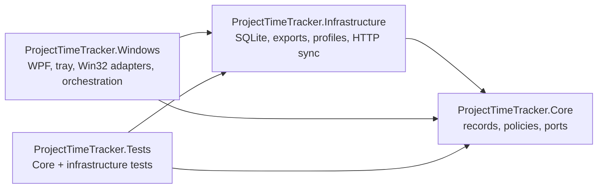
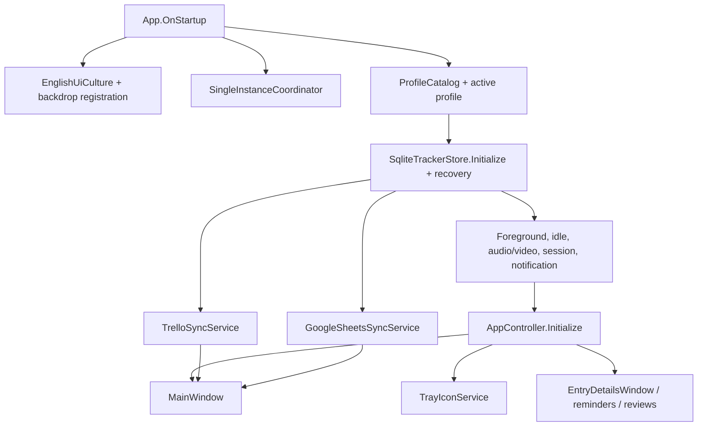
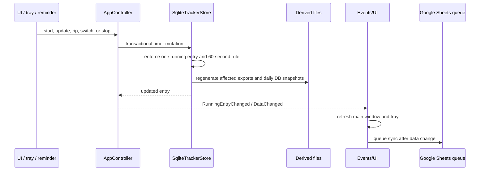
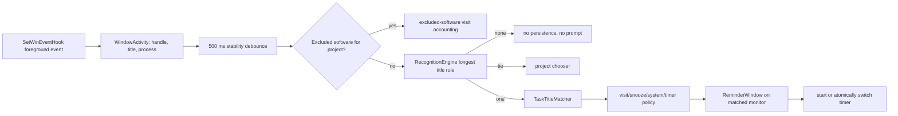
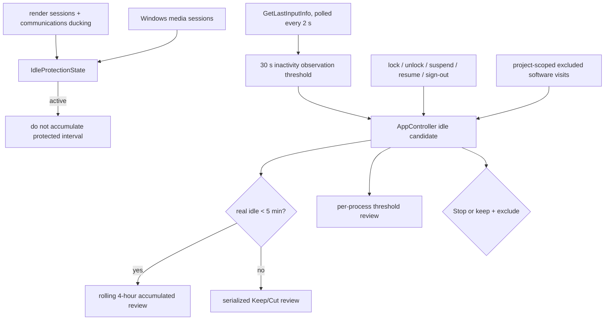
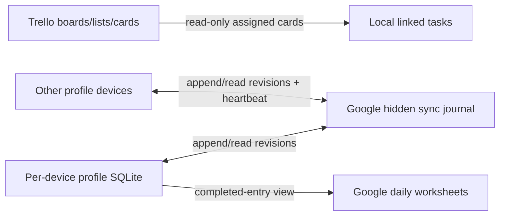

# Architecture

## Assembly dependency map

`Core` targets plain `net10.0`. `Infrastructure` also targets `net10.0`. The WPF host targets `net10.0-windows10.0.19041.0`, enables WPF and WinForms, and uses WinForms only where Windows tray integration is convenient.

## Layer responsibilities

### ProjectTimeTracker.Core

- Domain records and enums in `Models.cs`.
- Platform/storage ports in `Interfaces.cs`.
- Pure recognition and reminder suppression in `RecognitionEngine.cs`.
- Window-title task inference in `TaskTitleMatcher.cs`.
- Tags, dates, time text, target periods/debt, one-time target lifecycle, wrapping opportunities, idle accumulation, and overlap helpers.
- `SystemClock` as the default `IClock` implementation.

Core has no WPF, Win32, SQLite, filesystem, HTTP, or registry dependencies.

### ProjectTimeTracker.Infrastructure

- `SqliteTrackerStore`: the `ITrackerStore` implementation and transactional source of truth.
- `ProfileCatalog`: profile registry and profile directory lifecycle.
- `MonthlyLogWriter`, `DailySafetyArchive`, `CsvExporter`: derived exports and safety artifacts.
- `TrelloApiClient` and `TrelloSyncService`: read-only Trello import/reconciliation.
- `GoogleSheetsApiClient` and `GoogleSheetsSyncService`: OAuth, hidden journal/device worksheets, incremental reconciliation, and derived daily views.
- `SqliteDatabaseMigrator`: legacy database copy into the Documents location.

Infrastructure knows Core but not WPF.

### ProjectTimeTracker.Windows

- `App.xaml.cs`: composition root and application lifetime.
- `AppController.cs`: runtime application state machine.
- `MainWindow.xaml/.cs`: shell and main feature workflows.
- `Views`: modal editors and non-modal/reminder windows.
- `Controls`: dark date range, rich tag editor/display, and target ring.
- `Services`: Win32/Windows adapters, tray, notifications, smooth scrolling, backdrop, autostart, credentials, and single-instance coordination.
- `ViewModels/DisplayModels.cs`: UI projection records; there is no full MVVM layer.
- `Themes`: semantic tokens, vector icons, controls, and chrome.

## Composition and ownership

`App` owns and disposes the store, controller, integrations, tray, single-instance coordinator, and popup instance. `MainWindow` receives those dependencies through its constructor. There is no service locator or DI container.

## Startup sequence

1. Force English UK UI culture and register common dark window backdrop handling.
2. Acquire the legacy-named local mutex/event. A later instance signals the first instance to activate its main window and exits.
3. Resolve the data root from `PROJECT_TIME_TRACKER_DATA_DIR` or `Documents\TimeTracker`.
4. Load `profiles.json`, optionally select `--profile <guid>`, and resolve that profile's directory.
5. For the Default profile only, copy the old `%LocalAppData%\ProjectTimeTracker\tracker.db` if the new database is missing.
6. Initialize Windows' SQLite provider, schema/migrations, system entities, cleanup, derived files, and interrupted-timer recovery.
7. Construct Windows monitors and `AppController`; load settings and start monitors/timers.
8. Construct per-profile Trello and Google services using Windows Credential Manager.
9. Construct `MainWindow`, start periodic integrations, and construct the tray.
10. Open the window unless `--background` was supplied and the profile already contains clients.

## Timer and persistence flow

Timer checkpoints run every 30 seconds. Live elapsed time comes from `IClock` and subtracts persisted exclusions. The controller also evaluates the current net-work streak each second: it carries across timer switches/rips, resets when tracking stops or an idle review occurs, and emits a non-blocking break toast at every per-profile interval. A clean shutdown stops the timer. Recovery closes or reviews interrupted work according to the saved session behaviour.

## Foreground recognition flow

Recognition candidates come only from enabled rules attached to active, unfrozen clients/projects. Freezing a project temporarily disables its rules and preserves their prior enabled states for restoration when the project is unfrozen. Rule title comparison is case-insensitive; optional process comparison removes `.exe`. Longest title phrase wins. Task matching ignores delimiters and recognizes word/camel-case boundaries, preferring one unambiguous best saved-task match. If none is recognized, a path-like title with a file extension supplies the basename as editable task text; camel-case boundaries are converted to spaces. Accepting the reminder creates or reuses that task. Whitespace-only corrections to an already matched non-Trello task are renamed in place so its identity and history are retained.

The reminder service owns one active recognition popup. `Gimme break!` snoozes recognition for five minutes. A task typed in a reminder or its automatic details popup is marked notification-created; the store removes it if no entry retains it. Ordinary startup deliberately does not treat the already-focused window as a new recognition visit.

## Idle, media protection, and Windows sessions

The 30-second monitor threshold makes short inactivity observable; it is not the long-idle review threshold. Real idle intervals under five minutes can accumulate in the rolling four-hour policy. Five minutes or more is reviewed independently. Excluded software and Windows-unavailable intervals are separate sources and never enter the short-idle total.

Audio/video protection is output-only. It uses Windows render sessions, communications ducking state, and Global System Media Transport Controls. It never opens microphone capture devices.

## UI architecture

`MainWindow` is a continuous custom-chrome shell with a timer composer above four main tabs. A responsive layout keeps a 275/240 px sidebar at normal widths and uses floating navigation below 1040 px.

The UI projection pipeline is:

`ITrackerStore records → MainWindow.RefreshAllAsync → DisplayModels → WPF ItemsSource`

`RefreshAllAsync` uses a `_loading`/`_refreshPending` guard to serialize refreshes. Individual tabs also have targeted refresh methods for History, Reports, Trello, and Google Sheets.

The WPF resource order is:

1. `CodexDark.Tokens.xaml`
2. `CodexDark.Icons.xaml`
3. `CodexDark.Controls.xaml`
4. `CodexDark.Chrome.xaml`
5. broader default styles and templates in `App.xaml`

Use the semantic resource keys rather than adding literal shell colors to a screen.

## Integration direction

- Trello is an inbound task catalogue only.
- Google Sheets is a two-way whole-profile revision transport; SQLite remains the local operational store and visible daily tabs are never imported as authoritative rows.
- Neither integration replaces SQLite as the running application's source of truth.

See [GOOGLE_SHEETS_SYNC.md](GOOGLE_SHEETS_SYNC.md) for the schema-27 local state, hidden worksheet contracts, revision graph, conflict resolution, and device-presence lifecycle.
