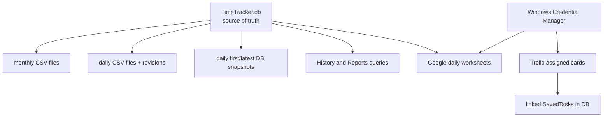
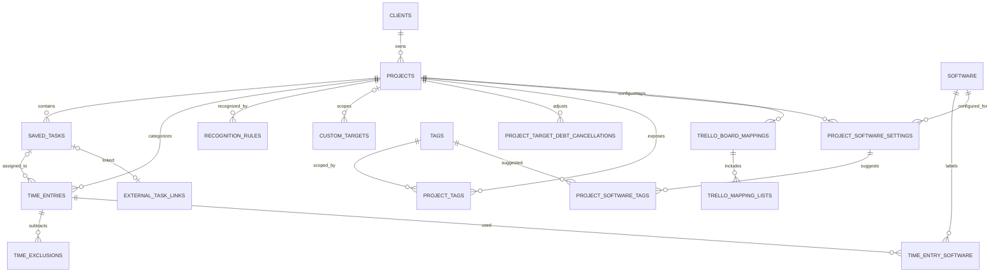

# Data, storage, and integrations

## Source-of-truth model

The per-profile SQLite database is authoritative. Everything else is either configuration metadata, a credential, a derived export, or a safety copy.



Do not rebuild SQLite from CSV or Google Sheets automatically. There is no implemented restore importer.

## Directory layout

Default root:

```text
Documents\TimeTracker\
├─ profiles.json
├─ TimeTracker.db                         # Default profile
├─ TimeTracker-Logs-YYYY-MM.csv           # local export mode
├─ Daily Logs\
│  ├─ TimeTracker-Logs-YYYY-MM-DD.csv
│  └─ Revisions\YYYY-MM-DD\...csv
├─ Daily Backups\
│  ├─ TimeTracker-Backup-YYYY-MM-DD-first.db
│  └─ TimeTracker-Backup-YYYY-MM-DD.db
└─ Profiles\
   ├─ <profile-guid>\                     # secondary profile, same contents
   └─ Removed\<timestamped-profile>\      # archived removed profile data
```

`PROJECT_TIME_TRACKER_DATA_DIR` overrides the root. Tests and WPF smoke checks must use it so real user data is never touched.

The first/default profile keeps its files directly in the root for backward compatibility. New profiles use `Profiles\<guid>`. `profiles.json` contains the catalogue version, active profile ID, names, and directory-role metadata—not time entries.

If the root is not overridden, startup can copy the legacy `%LocalAppData%\ProjectTimeTracker\tracker.db` to the Default profile's `Documents\TimeTracker\TimeTracker.db` when the destination is missing.

## SQLite configuration

- Provider: `Microsoft.Data.Sqlite.Core` with Windows `winsqlite3`, selected by `WindowsSqliteRuntime`.
- Connection mode: read/write/create, shared cache, foreign keys enabled.
- Runtime pragmas: foreign keys on, WAL journal mode, 5-second busy timeout.
- Timestamps: UTC ISO round-trip text.
- Current `PRAGMA user_version`: **24**.
- Upgrade: before an existing older database is changed, a sibling `TimeTracker.db.backup-v<old>-<timestamp>` is created.
- Initialization also ensures system entities, removes invalid sub-minute completed entries and unused notification-created tasks, synchronizes tag definitions from descriptions, and refreshes derived files.

## Simplified relational map



Additional singleton/operational tables are `TrelloConnections`, `Settings`, and `GoogleSheetsEntryDeletions`.

## Important constraints

- Client names are case-insensitively unique.
- Project names are unique within a client.
- Local task names are case-insensitively unique within a project. Trello tasks may duplicate names because external card identity is the key. Notification-created tasks are tracked separately so an unused one can be removed without affecting intentional local tasks.
- Tag names are case-insensitively unique.
- Software process names are case-insensitively unique.
- One partial unique index permits only one `TimeEntries.EndUtc IS NULL` row.
- `TimeExclusions.EndUtc` must be later than `StartUtc`.
- Project currency is PLN, USD, or EUR.
- Targets must have positive hours; one-time completion is stored in `CompletedUtc`.

## System entities

Fixed GUIDs in `SystemEntityIds` represent:

- Unassigned client.
- Unassigned project.
- Global software scope.
- Global tag scope.

The Unassigned project supports tray starts without choosing a project. UI projections generally hide these implementation entities or render them as explicit Unassigned options.

## Mutation and derived-file policy

`SqliteTrackerStore` refreshes derived files after mutations that can change historical output: entry changes, exclusions, names, rates, tags, software labels/associations, destructive removal, Trello reconciliation, and recovery.

The refresh is guarded by `_monthlyLogSync` and runs after database transactions close. Do not call it while holding an SQLite transaction because it opens a new connection and would risk lock contention.

### Local export mode

- One atomic UTF-8 CSV per local start month.
- One atomic CSV per local start day.
- If a past daily file changes, its previous content is copied into a timestamped `Daily Logs\Revisions\<date>` folder first.
- Each refresh creates/updates a valid SQLite backup for today.
- The first snapshot of the day is retained separately; the latest snapshot is overwritten atomically.

### Google Sheets export mode

When `storage.logExportDestination` is `google-sheets`, automatic monthly and daily local CSV writing is disabled. Daily SQLite snapshots still run.

The service:

- Is profile-scoped.
- Stores client ID, client secret, and refresh token in Windows Credential Manager.
- Stores non-secret account/spreadsheet/status metadata in the profile's `Settings` table.
- Creates one spreadsheet named `Log O'clock - <profile>` and one worksheet per `yyyy-MM-dd` local start date.
- Queues a sync five seconds after app data changes and every 15 minutes while running; Settings also exposes Sync now.
- Merges by `EntryId`, with local rows winning for the same ID.
- Preserves valid remote-only rows in the worksheet.
- Uses `GoogleSheetsEntryDeletions` tombstones to remove individually deleted or automatically discarded sub-minute entry IDs from worksheets, then clears acknowledged tombstones.

It **does not import remote-only worksheet rows into SQLite**. Consequently it is not multi-device synchronization and cannot make a laptop load entries created on another machine.

Known gap: the current project/client bulk-removal methods delete their entries directly without first inserting `GoogleSheetsEntryDeletions` tombstones. A later cloud sync can therefore preserve those old remote rows. Treat closing this gap as a persistence/integration change with store tests; do not describe Google Sheets as a fully authoritative mirror until it is fixed.

## Trello data direction

Trello credentials live in Windows Credential Manager per profile. Connection status, board/list mappings, and external task links live in SQLite.

Each active board mapping belongs to one local project and selects one or more lists. Sync keeps only open cards assigned to the connected member. Reconciliation is transactional per mapping:

- New qualifying card → create linked Trello task.
- Remote rename/list move → update same linked task.
- Card leaves scope with no history → delete task/link.
- Card leaves scope with history → detach to editable local task and retain external identity.
- Detached card returns → relink same task.
- User removes linked task → archive/suppress so sync does not recreate it.

Trello descriptions, labels, comments, due dates, attachments, and other members are not stored.

## Delete/archive semantics

- Removing a project physically removes its entries, tasks, targets, rules, software settings, Trello mappings/links, debt adjustments, and other project-scoped records through store cleanup and foreign keys.
- Removing a client does the same for all its projects, then removes the client.
- Removing a standalone target is a physical delete.
- Removing a saved task generally archives it so historical references retain identity. Trello reconciliation has special delete/detach/suppress rules.
- A task typed from a recognition notification or its automatic details popup is marked as notification-created. It is physically deleted when no `TimeEntries` row references it, including after later correction, entry deletion, or sub-minute entry cleanup. A task explicitly created in the Tasks tab remains even when it has no entries.
- Removing software hides/removes it from management, deletes historical entry-software associations, and clears correlated settings/tags.
- Removing a tag converts managed description markers to plain text semantics and removes the shared definition/scope.

Every destructive path must refresh derived exports. New destructive paths that remove entries should also enqueue Google deletion tombstones; project/client bulk removal is the currently documented exception.

## Privacy boundary

- No telemetry or app account.
- Raw observed window titles are processed only in memory.
- Process names can be stored only as configured Software definitions or entry associations while tracking.
- Audio/video protection stores no sessions, media metadata, observations, or history.
- Trello and Google are contacted only when configured for the active profile.
- Credential values must never enter SQLite, logs, CSV, error strings, URLs used for authenticated API requests, or screenshots.
